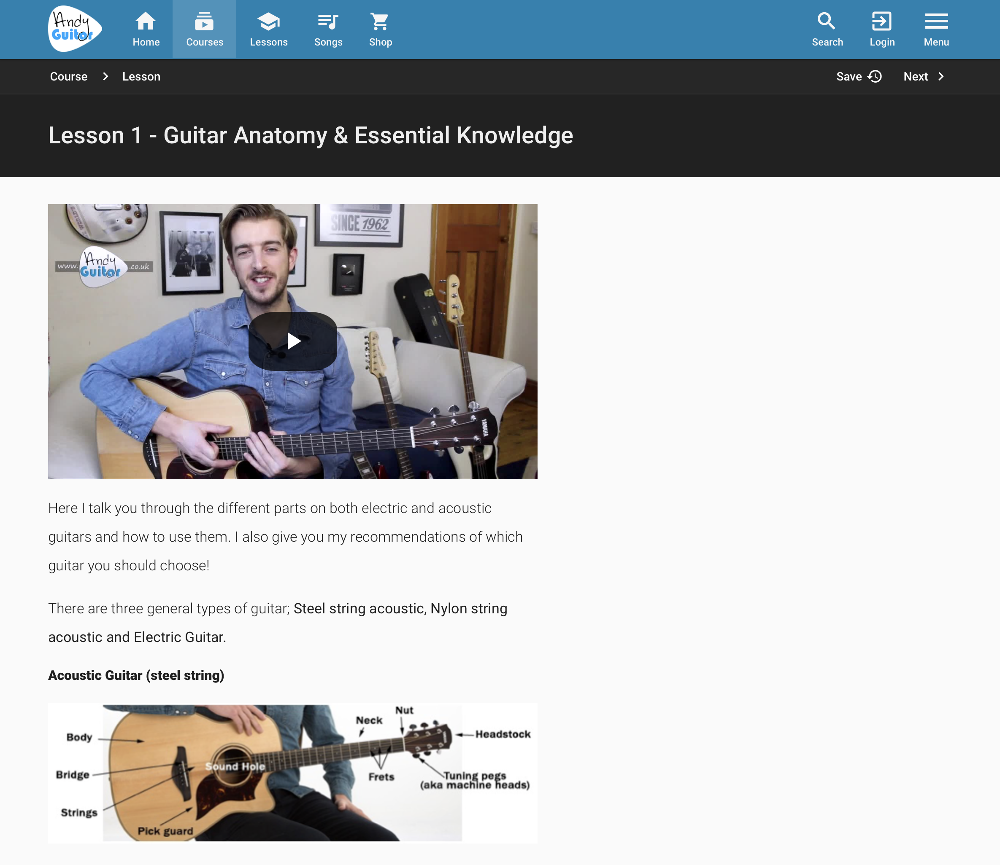
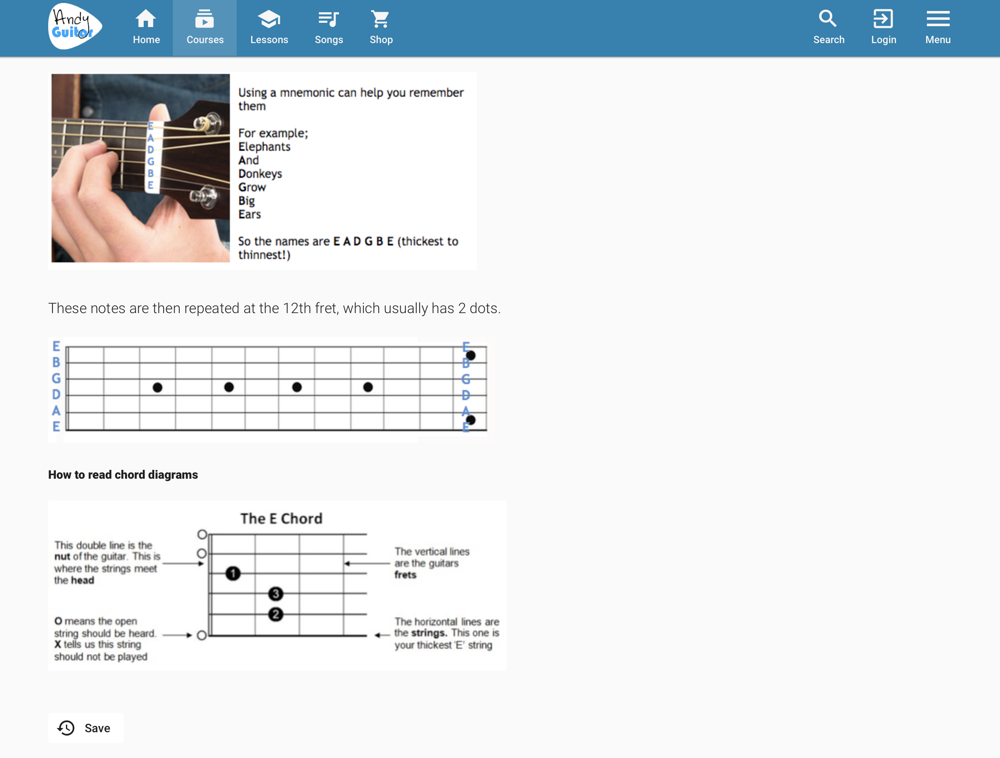
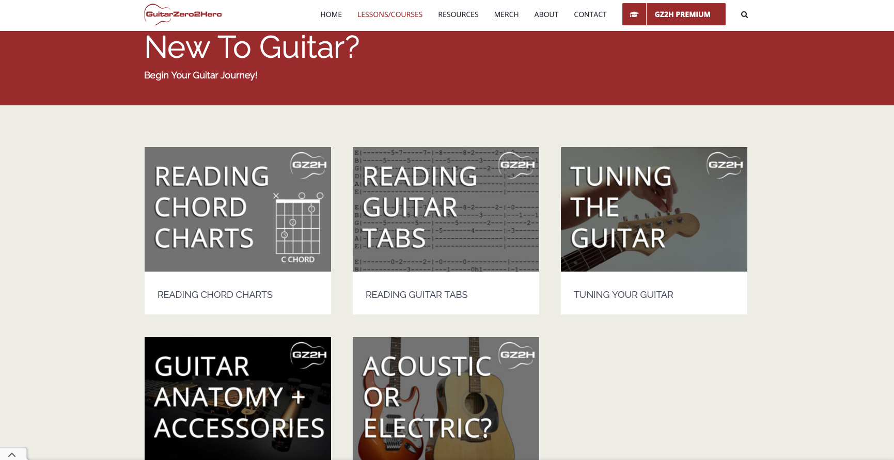
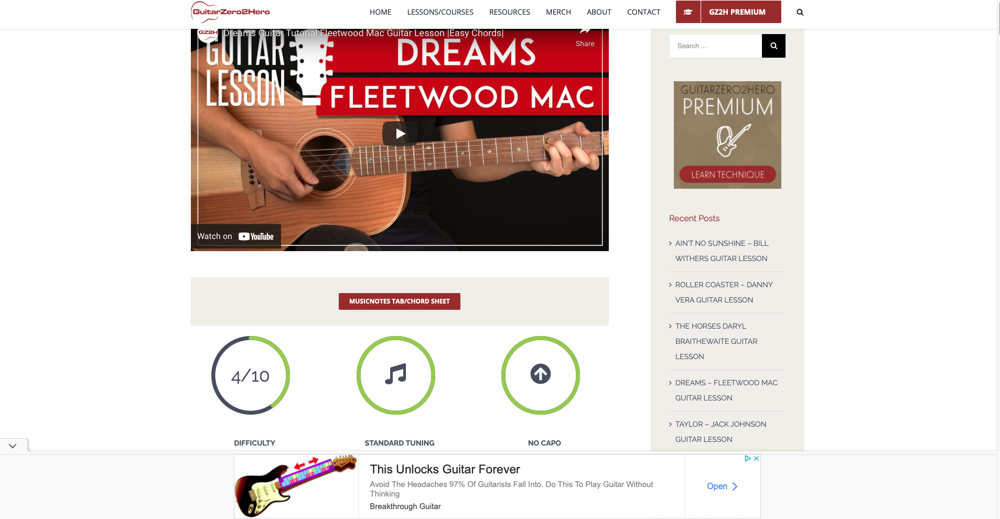

# Assignment 1 Heuristic Evaluation. Alejo Fernandez

## Tentative title: GuitarmadeEZ

# Description:

  - Music is a universal language to the ear. You hear the guitar in a folk Spanish song and can't help but admire that noise or you hear the soulfulness the guitar can convey in rhythm and blues and it's hard to deny the sensation of hearing this specific instrument. Essentially music is everywhere and now that we are living in the digital age it may be the easiest time to learn how to play the guitar. My personal example began at the beginning of the Global Pandemic of Covid-19 I decided I wanted to teach myself how to play the guitar. It was painful but also very rewarding. 

  - My experience in being self taught will provide a valuable perspective for this project since the objective is to contribute an improved user experience to the website of my choice. Although technology can readily provide users with the tools to learn a skill, it can become a daunting task due to the amount of information a student encounters. There are thousands of websites and applications available to learn how to play the guitar. That is why I want to focus on two websites at the moment. 

  - The first is: https://www.andyguitar.co.uk
  - The second is: https://guitarzero2hero.com

  - I want my UX project for this course i want to make an online guitar learning service that will make learning by yourself an easy and intuitive task.I want this project to consider middle-aged men as its target market. I want people to feel like they are navigating the website as easy as one navigates the google search bar while also providing users enough information to not overwhelm them, like a wikipedia abstract, so-to-speak. I think having a guitar learning website that is easy to search for things while also providing a brief description of what you need, and are learning will make the entire process simpler. 

The Evaluations I am going to present were performed with https://www.nngroup.com/articles/ten-usability-heuristics/ as it baseline.

The severity rating was performed using the following https://www.nngroup.com/articles/how-to-rate-the-severity-of-usability-problems/ as its baseline.

# Andyguitar.co.uk

Andyguitar (https://www.andyguitar.co.uk ) is a guitar learning website that provides lessons in both acoustic and electric guitar. The lessons range from: Pathway courses, lead guitar, rock guitar pathway, and fingerstyle. Users are able to pick what type of course they want to begin with or search for a specific tutorial/song. This website allows users to follow along with videos while also providing a short informative description of the lesson.
This is an image from the first lesson. This lesson is providing the basics of how to hold a guitar and the anatomy of the guitar.

Evaluation: Overall this website is easy to navigate and gets you straight to the point. The majority of users will find what they want and will be able to follow along to instructional videos fro their guitar lesson needs. There are minor tweaks that can be made such as incorporating different colors so that tool icons can be visible, synchronization of guitar strumming and chords while the lesson is played on the video, and lastly a forum would increase the brands customer retention since it will allow users to engage with other like minded individuals. 

# Heuristic & Description
Evaluation
Improvement/
Recommendations
Severity Rating

1. Visibility of system Status:The website/app clearly communicates the system's status to the user and presents feedback to user within reasonable of actions they are currently doing

GOOD: The user is able to track their progress from the path that they elect. The paths(module) are broken down into a series of lessons numbered, with the first lesson being the easiest while progressively getting more difficult. 

The lessons are accompanied with a video lesson in which Andy instructs you on what to do.

The lessons also provide a diagram/picture in TAB or Chord format.

BAD: while the lesson is playing on the video format there is no follow along format. For example, the video doesn't show the music being play, anything he just provides a tab of the chord shape.

The recommendation i have for improvement on this website is to introduce a play-along format. For example if i want to learn how to play “ come together” by the Beatles, then he should have the chord shapes visually on the video with the amount of times the chord is played while also introducing the strumming pattern visually. All of it should synchronize together smoothly.

Severity rating 3

2. Match Between System and the Real World: 
The website/app uses language that is familiar to the user, rather than system-oriented terms, and presents information similarly to the real world.
GOOD: The website uses familiar language and text that are common convention in the real world. The Categories are easy to find and intuitive to navigate.

No recommendation for improvement.

0

3.User Control and Freedom: 

The website/app allows users to easily undo an unwanted action. Supports undo and redo.
GOOD: the user is able to easily exit, go back or go forward navigating the website and lesson. The best feature is the save feature which will save your spot if you were to exit the lesson suddenly. 

BAD: The color used to color the exit, save, forward, back options gets lost while looking at the website
The recommendation i have for this website is to have an autosave feature for users that already have existing accounts. Additionally i would change the color of the save, exit, forward,back from gray to a patel yellow so that it catches the users eye but doesn't distract the user from the rest of the website/page

Severity rating:1

4. Consistency and Standards: 
The website/app follows typical conventions of other apps/websites.

GOOD: The website is good in keep a consistent theme and web layout so that the user can navigate easily.

BAD: The website focuses and relies on the video instruction that Andy, the guitar instructor, already posted on Youtube. 
My recommendation for this part is to improve on the website's standards. The free version is essentially a library of works that Andy has created and posted on Youtube. In order to enhance his website and engage his website rather than his youtube is to improve on the standards that other sites have. One example is to include visual aids that demonstrate the chords while the video instruction is playing and also doing the same for the strumming pattern.

Severity rating:2

5.Error Prevention: 
The website/app prevents error-prone conditions or checks for errors and notifies user before committing an action.

GOOD: the website has the save feature for users to prevent lost of progress or where they left off. If the website is down the lessons are available on Youtube as well.

BAD: The website does not ask the user to confirm their consg choice, the site also does not have a confirmation for existing the site.
The recommendation for this aspect of the website is to incorporate an option for users to add the error prevention tools. A switch that will allow you to get notified before you exit the website and a switch to allow you to confirm your lesson choice.

Severity rating:1

6.Recognition Rather than Recall: 
The website/app minimizes recall and instead makes icons, labels, actions visible to user.

GOOD: The website’s labels, icons, and actions are static. This means that they are always visible on the website weather you scroll up and down or enter a tab from the site.

BAD: the website obligates the user to create an account in order to use any of the tools they provide.
The recommendation I have for users that don't have an account is to limit the tool access. This will allow the user to see the benefit of the tool and hopefully convince the user the tool is worth creating an account.

Severity rating:1

7. Flexibility and Efficiency of Use: 
The website/app is customizable such that the functions can cater to beginners and experts.

GOOD: The website is simple and easy to use for people that are technologically savvy. 

BAD: The site has functions and tools that are only available for people that create accounts. This may prevent users from creating an account because they have not seen the benefits yet.

The recommendation for this part is to allow users to customize their options more so that if you do not have an account you can still see the benefits of the tools that come along with the account.

Severity rating:1

8.Aesthetic and Minimalist Design: 
The website/app only contains needed and relevant information.

GOOD: The website is simple and contains relevant information.

Recommendation is to provide a color distinction for important features.

Severity rating:1

9. Help Users Recognize, Diagnose, and Recover from Errors: The website/app presents user with clear error messages, indicating the error and providing a solution.

GOOD: The website provides clear error messages with proper explanation and ways to trouble shoot the errors.

No recommendation for improvement 
Severit rating:0

10.Help and Documentation:
The website/app provides understandable and easily accessible documentation for understanding how to complete the task at hand, if needed.

GOOD: the website provides clear feedback to its users when navigating the website. The lesson and pathways are easy to navigate following the titles. 

BAD: The website offers no FAQ page nor a forum for users to engage with one-another.
The recommendation for this part of the website is to include a forum for users to engage with so that they can learn from each other. See what works for someone. This will help build a community around the brand.

Severiy rating:2

# Guitarzero2hero

Guitarzero2hero is a website that allows users to understand guitar essentials and learn how to play the guitar. Users have the freedom to use the free version of the site or upgrade to the premium version of the site. Additionally, users can select songs based on their favorite artists or they can search for a song by the title. The idea behind this feature is from the creator of the website, David Tran, he mentions that the best way to learn to play the guitar is to pick a song that you like and challenge yourself to learn it. As someone who taught themselves the guitar I can attest to what David Tran mentions.

Overall: Overall Guitarzero2hero is a great website for users to learn how to play the guitar. It has a bit of an unconventional teaching style as it does not provide absolute beginners with much content. Rather Guitarzero2hero focuses more on the guitar player that already knows how to hold the guitar and the name of the strings. If the user has the basics down then the website is good for beginners. It houses conventional style and it also incorporates modern touches such as having the chords shape live while the instructor is demonstrating the tutorial. 

# Heuristic & Description
Evaluation
Improvement/
Recommendations
Severity Rating

1. Visibility of system Status:The website/app clearly communicates the system's status to the user and presents feedback to user within reasonable of actions they are currently doing

GOOD: The website has tools and icons that allow you to understand what they do in regards to the status of the system. The website also has made it clear to distinguish between the premium user and the free user experience.

BAD: The website is designed for people that already have some experience. The free version doesn't let you pick a beginners course, it just lets you pick beginner songs. 

I think the website should have an absolute beginner's section that teaches you how to hold the guitar, name of the string and any other essential info. 
Additionally, the website would benefit from having a save or tracking of progress feature.

Severity rating:3

2. Match Between System and the Real World: 
The website/app uses language that is familiar to the user, rather than system-oriented terms, and presents information similarly to the real world.

GOOD: The website uses familiar language so that any user can easily navigate it. The blog articles are great since this project is trargetting middle aged men, one of the blog articles on the landing page address users worries about their age. 

BAD: The google adds on the bottom of the page make it difficult for the user to focus on the webpage since there isn't a clear cut way to stop the ads. They only go away momentarily. 

My recommendation for this part of the evaluation is to limit the amount of ads that are presented to users. This may be an issue for non-premium users only though. 

Severity rating:2

3.User Control and Freedom: The website/app allows users to easily undo an unwanted action. Supports undo and redo.

GOOD: User is able to navigate in any fashion the user wants to when looking at lessons and song tutorials.

BAD: The user doesn't have the same abilities in other area of the website. The merch site once you click on a product the menu header disappears.

The recommendation I have for this segment of the website is to have the header appear on all of the aspects in the website. 

Severity rating:1

4. Consistency and Standards: 
The website/app follows typical conventions of other apps/websites.

GOOD: The website follows common web layouts that are typical of industry standards. The website has an intuitive feel which makes it user friendly.

BAD: The header menu bar is not highlighted enough when hovering over the menu options

The recommendation I have for this part of the evaluation is to have the header menu become more visible whether or not the users’ mouse is hovering over the menu. Users in that age range won't be as tech savvy as younger users nor will they have the same eyesight.

Severiy rating:1

5.Error Prevention: 
The website/app prevents error-prone conditions or checks for errors and notifies user before committing an action.

GOOD: The site is straightforward to navigate. 

BAD: The site does not have any save feature if you are looking at a lesson or guitar tutorial. 

The recommendation i would add to this module is to include a save progress or creating a way so that users can save their progress.This may be an issue that is resolved in the premium version of the site.

Severiy rating:1

6.Recognition Rather than Recall: 
The website/app minimizes recall and instead makes icons, labels, actions visible to user.

GOOD: The icon and labels are visible and are typical for industry standards.

BAD:The labels are hard to see when not hovering directly over the label

The recommendation I have for this part is to make the labels a little bit bigger and have the labels pop in color more than they currently do whether or not the user's mouse is hovering over the label.

Severity rating:2

7. Flexibility and Efficiency of Use: 
The website/app is customizable such that the functions can cater to beginners and experts.

GOOD: The website allows users to search for songs by title or artist. The website also indicates the difficulty level,the type of tuning, and if a capo is needed.

BAD: NON-premium users don't have the ability to save their progress on a song they are learning 
The website would benefit by creating a category menu tab so that users can search either lessons or song tutorials by difficulty level.

Severity rating:2

8.Aesthetic and Minimalist Design: 
The website/app only contains needed and relevant information.

GOOD: The website contains needed and relevant information 

BAD: the website spams the user with ads. 

The premium version should fix this issue by not having any ads.

Severity rating:1

9. Help Users Recognize, Diagnose, and Recover from Errors: 
The website/app presents user with clear error messages, indicating the error and providing a solution.

GOOD: The website's lessons clearly indicate what the user should do in case of any error, additionally the website is clear in detailing its instructions once the user has selected the lesson.

No recommendation for improvement 

Severity rating:0

10.Help and Documentation:
The website/app provides understandable and easily accessible documentation for understanding how to complete the task at hand, if needed.

GOOD: The website provides clear and easy to follow documentation in order to complete the task at hand. It provides the chords, tabs, and type of tuning while simultaneously being played on the video lesson.

BAD: The free version does not allow users to save their progress.

The premium version has save features so the only recommendation i have for the website is on the free side of it and it would be to implement a save feature so that users can go back to their latest progress.

Severity raing:1

