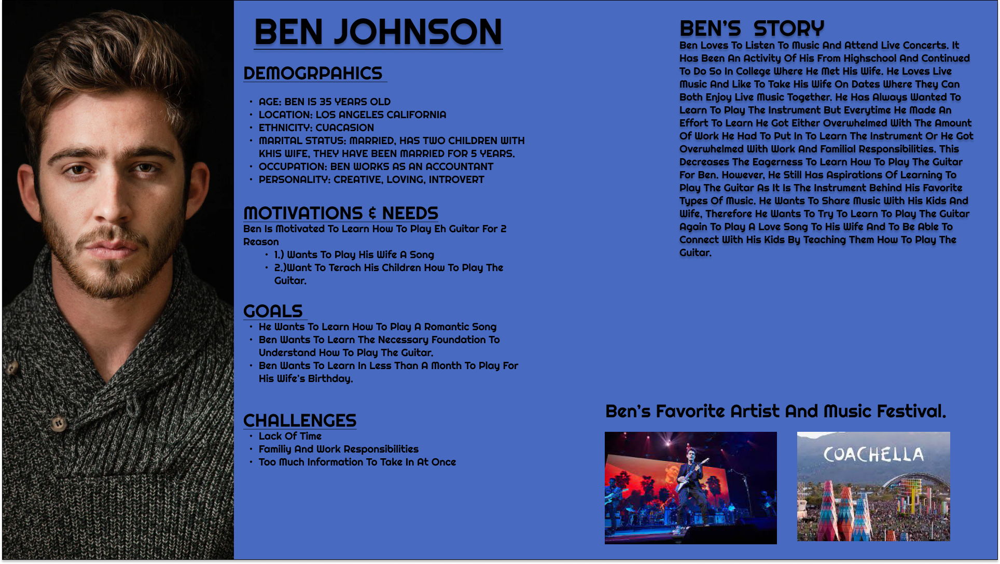
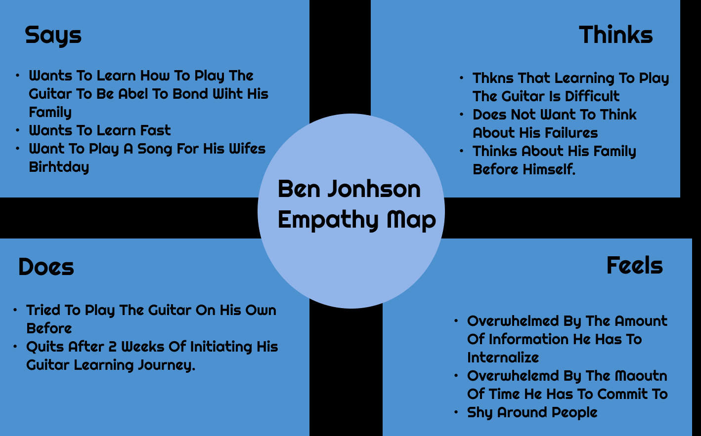
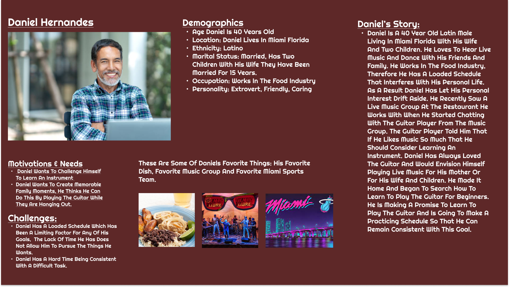
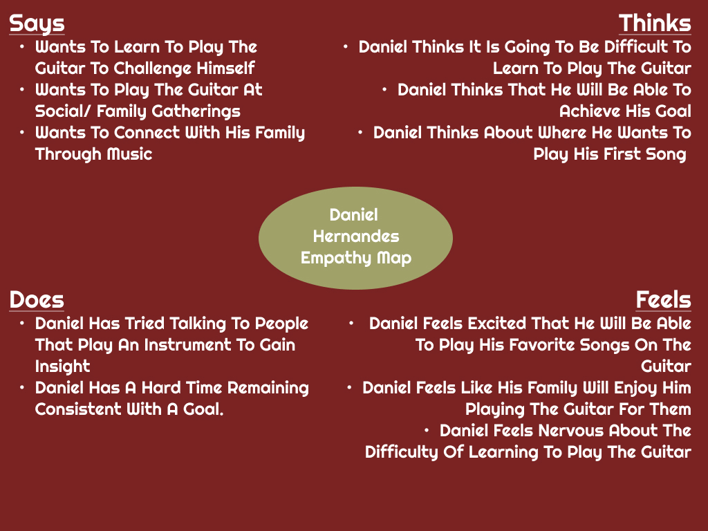
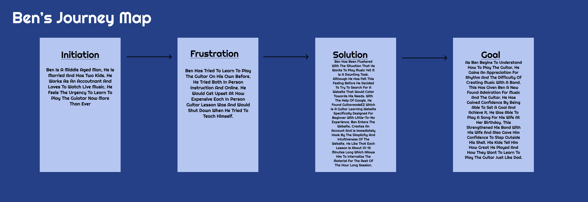
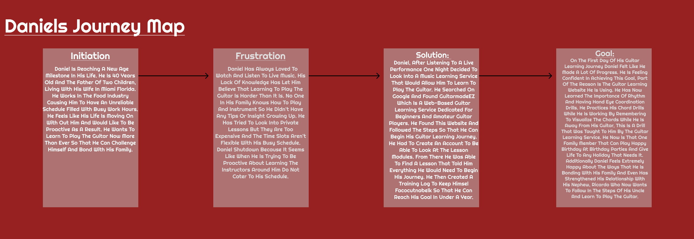

#### Alejo Fernandez | DH 110 User experience and Design | Spring 2022 UCLA

# The purpose of UX Storytelling
  - The creation of personas with a well designed user experience story creates an environment in which we can immerse ourselves completely to meet the needs of the user. By looking at their motivations, needs, goals and challenges we are able to make specific research questions that enable creators to create the best experience for the user. This approach lets us begin the service ideation process in a way that disrupts conventional thinking. With this type of methodology we are able to create a product based on user wants and needs instead of maximizing profits. Not that the end goal is to be profitable but rather the fuel used to drive our creativity is based on a user wanting to use our service over any other.

# Persona & Empathy Maps

### Persona 1: Ben Johnson

### Ben's Empathy map

### Persona 2: Daniel Hernandes

### Daniel's Empathy map

# Scenerios & Journey maps

 ### Ben's Scenario and Journey map 
 
  - ##### Why is Ben using this product? 
    - Ben is going to use this product so that he can learn to play a song on the guitar for his wife's birthday in a month. He is also wanting to use this product so that he can interact and engage with his family while also sharing his love for music. He thinks that now is the best time to learn since he is getting older and his life is getting busier and busier. As a result he decided to give himself one month of practice with the tool we are creating. He will be purposeful so that he can achieve his goal of playing a song for his wife and connecting his kids with his love for music.

  - ##### How is Ben using this product?
    -  Ben is going to use this product from the convenience of this home. He is going to be able to use it both on his laptop/desktop and his smartphone/tablet. He will be using this product to learn a lesson for one hour four days a week. He will practice what he learned the next day, without learning a new lesson. He will practice for 1 hour. His schedule for learning the guitar consists of 16 hours of video lessons with 12 hours of dedicated practice from the previous lesson. This type of structure is going to Keep Ben on track as he cna now commit his schedule with his work and family. This is a big difference for Ben since he usually stops wanting to learn after two weeks. 

### Ben's Journey map
 

### Daniels's Scenario and Journey map 
  - ##### Why is Daniel using this product? 
    - Daniel is wanting to use this product so that he can learn to play the guitar. The reason why he wants to use this product now versus before is that he feels like that music will help bond with his family when they get-together.

  - ##### How is Daniel using this product?
    - Daniel will be using this product from anywhere that he wants to since it is a web based learning service, that means that he can see lectures either on his desktop or his mobile device.  

### Daniel's Journey map
 
 
### Reflection

The process of creating personas accompanied with their corresponding empathy map, scenarios, and your map was a fun and creative project. I think this was a great project to get my creative flow going since it stimulated me, i had to think clearly about the type of research questions I wanted to ask and how I was going to find that information. Using polls,census data, and other publicly available information I was able to let my inspiration take the reins of this project. As a result I came up with two individual user personas across the United States that suited the assignment. I feel given more time to build the personas I could have done better with Ben by planning my research questions better, rather than choosing them as I go. Daniel's persona was more thought out because I was able to use Ben’s as a warm up.    
