#### Alejo Fernandez | A5- Low fidelity wire frame prototype | DH 110 UX/UI | Spring 2022, UCLA

# Overview

## About this project
  - #### The main objective for this website is to offer a free online course that allows users to learn how to play the guitar. GuitarmadeEZ is a website that is specifically designed for people that want to learn how to play the guitar with no prior experience. This low fidelity prototype is focusing on certain features so that the user has the best experience.

  - I created two different personas to get a better understanding of the user we are targeting for this project. The first user is Ben, he is a middle aged caucasian male, living in Los Angeles California with their two children. Ben has little previous experience with learning to play the guitar, he had tried learning but never stuck with his lessons. Ben’s goal was to be able to finally learn how to play the guitar so that he can play a song for her birthday and also bond with his children since they don't know how to play an instrument either. The second persona I created was that of Daniel Hernandes, he is a 40 year old latin male living in Miami florida with his two children and wife. He also  works in the food industry and wants to learn how to play the guitar. He has a bust schedule, having to be the primary owner puts stress on Daniel which is why he doesn't have enough time to pursue his interest.Daniel is going to use GuitarmadeEZ so that he can cerenade his family when they are gathered, he has always wanted to do this so that his family cna bond over music.

## Purpose of Low-Fidelity Prototyping

  - #### Low-fidelity prototyping is a low-cost method of designing and testing the usability of the features in a product (as well as how they are organized). The prototype outlines the flow of the features and how the user might navigate through them, without placing too much emphasis on appearances. Through low-fidelity prototyping, the designer can gauge the ease of use for the features of the product.

## Tasks
  - This low-fidelity prototype supports the following tasks, based on the presumed basic needs of the target audience:
  - Onboarding (creating account)
  - Search for song tutorial
  - Selecting a specific lesson 

## Wire Frames & Wire Flow

### This is the wire frame images for creating an account on "GuitarmadeEZ.com"

  - #### The first task consist of creating an account on the website.
    - #### The iamge below deonstrates the landing page of the website and then shows the following wire frame that instructs the user to input their email address.
  
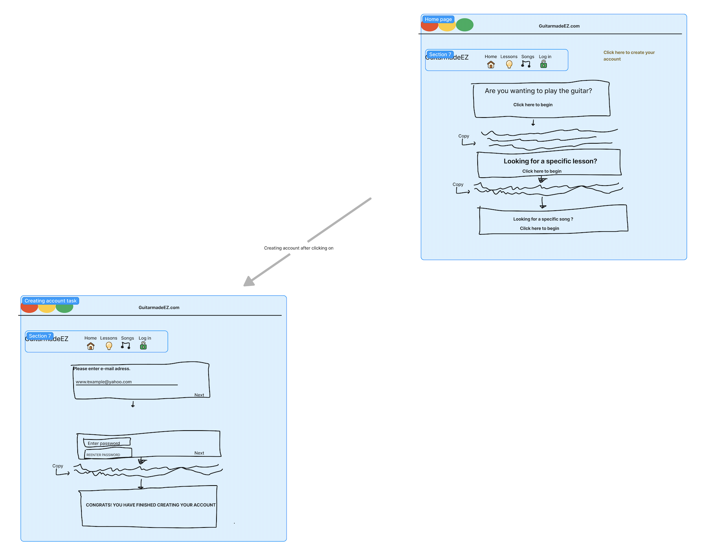

 - #### The iamge below demonstrates the user having to input a password to finalize their account creation

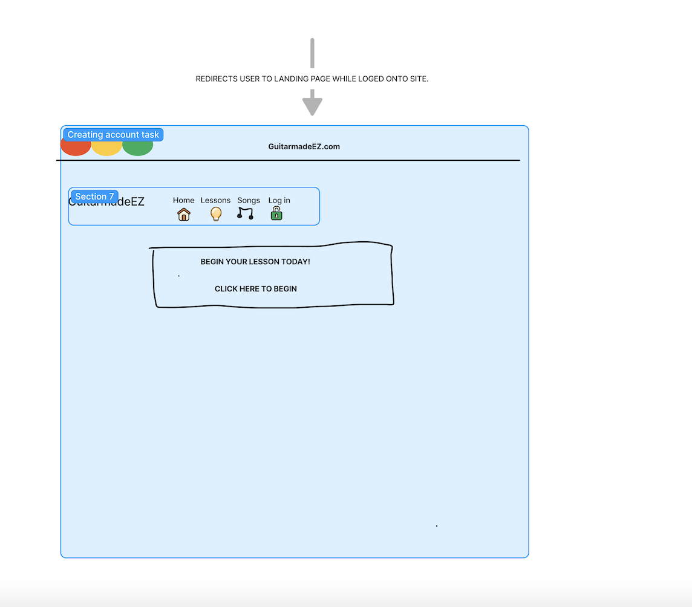

  - #### Below are the images of the 2nd task, which is searhcing for a song tutorial.

    - #### The iamge below demonstrates the home screen, the user will click on the song icon to begin the search.
    
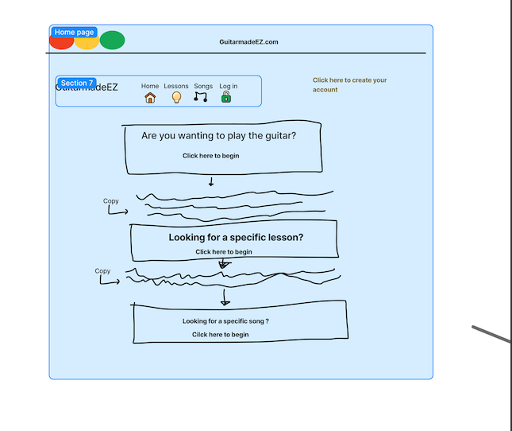

   - #### The image below is the 2nd step in the task, the user will be able to select their music choice
   
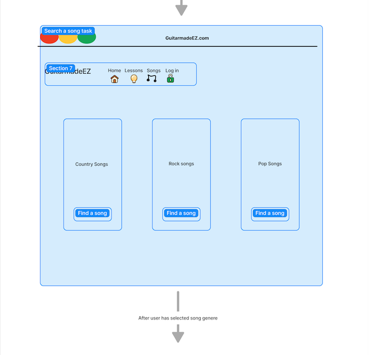

  - #### The image below is the third step, where the user has entered a different interface in whihc they can now select a apartiucalr song from the "Rock" Song category.
 
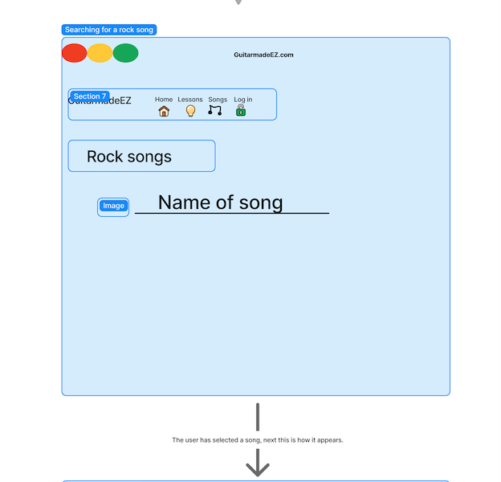

  - #### The image below is the alst step from the song tutorial task.
  
  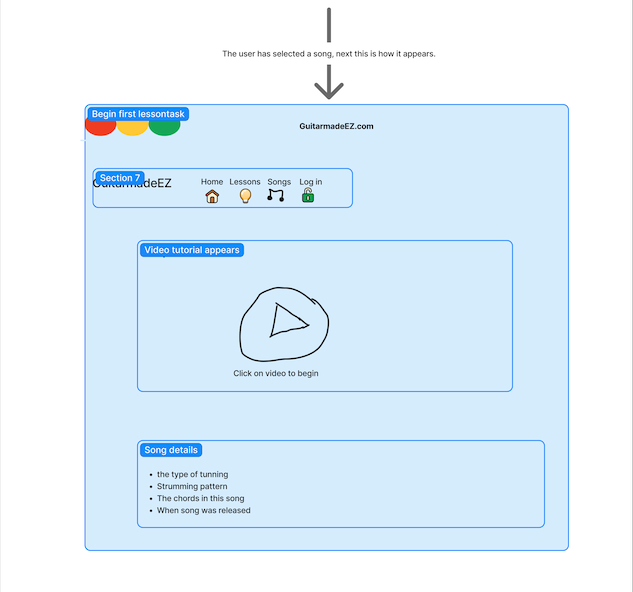
  
   - #### The third task consists of selecting a specific lesson.
   
   - #### The image below is the first step in selecting a specific lesson task

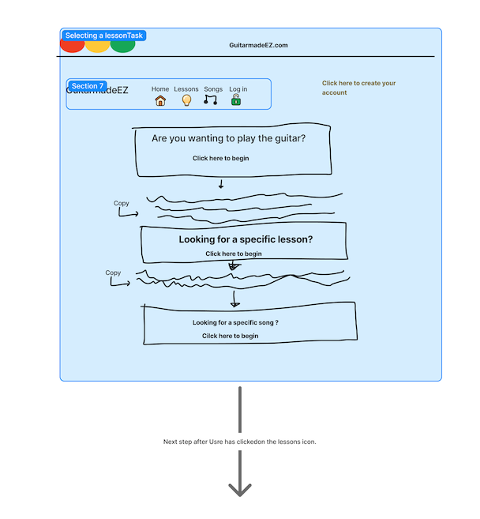

 - #### The image below is the 2nd step in selecting a specific lesson task, the user will have a preview of the lesson weeks 

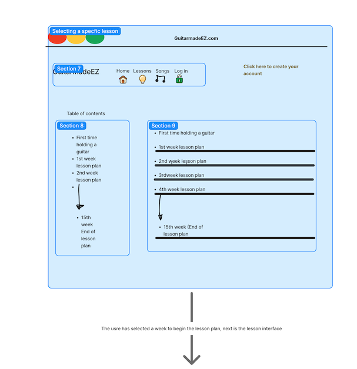

  - #### The image below is the 3rd step in selecting a specific lesson task, the user will enter the specific lesson planand will allow the usre to select whihc sub lesson they want to select.

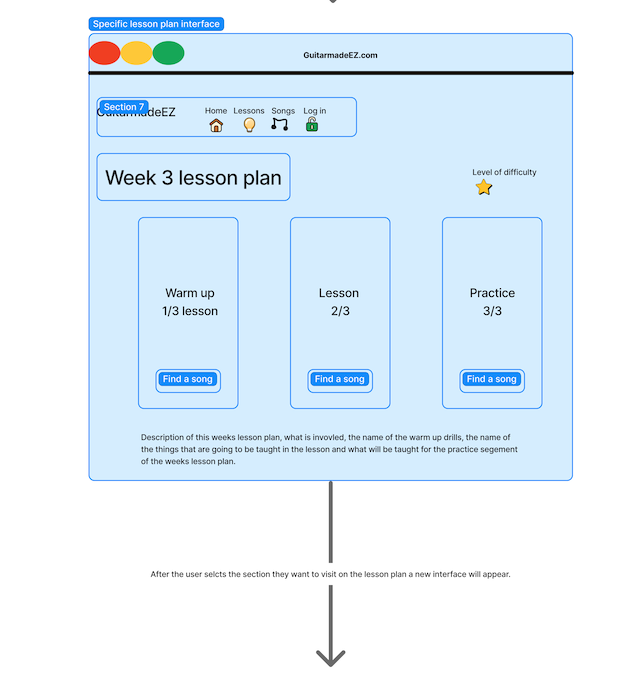

 - #### The image below is the 4th step in selecting a specific lesson task, the user will enter will see a new page layut with specific lesson information
  - The lesson video
  - Chord Diagrams
  - Song details

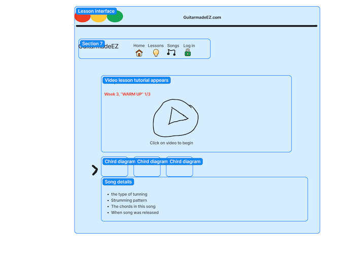

## Testing The wire flow

  - Task 1 Account creation, user is testing the flow of this task.
  - The user mentioned the follwoing " 
     -  Does it start when you already logged in or from create an account? 
     -  Will i only ask for email, no phone number, name, demographic info?
     - Suggest options for first courses user should take or some sort of test your skills."
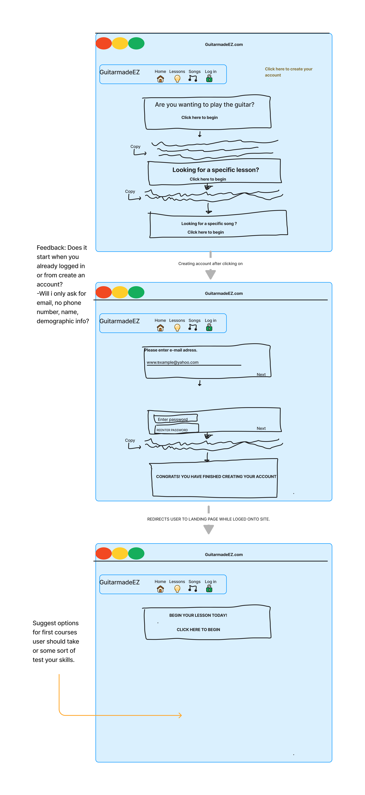

  - Task 2 Song tutorial task, User is testing the flow of this task.

![Wire fram test song tutorial task](Test-account.png

  - Task 3 selecting a specific lesson plan, user will test the flow of this task.

![Wire fram test lesson task](Test-account.png

## Reflection & Design Reccomendations

