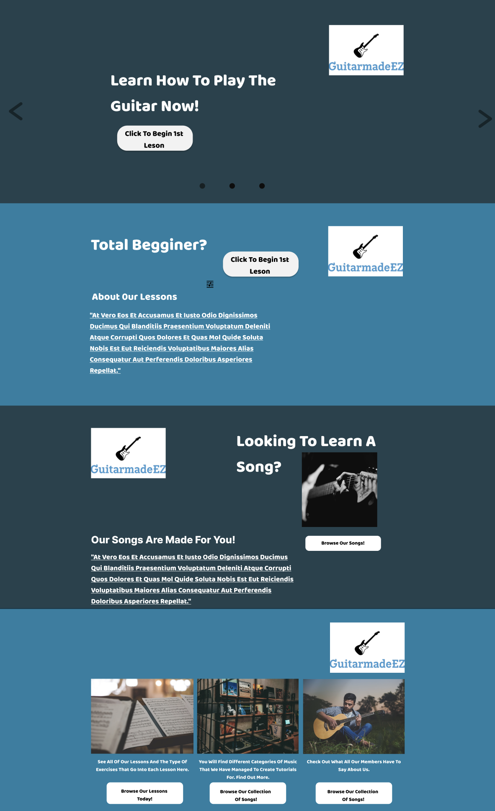
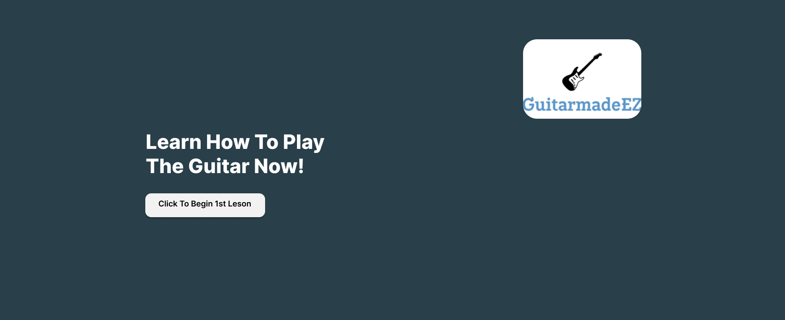
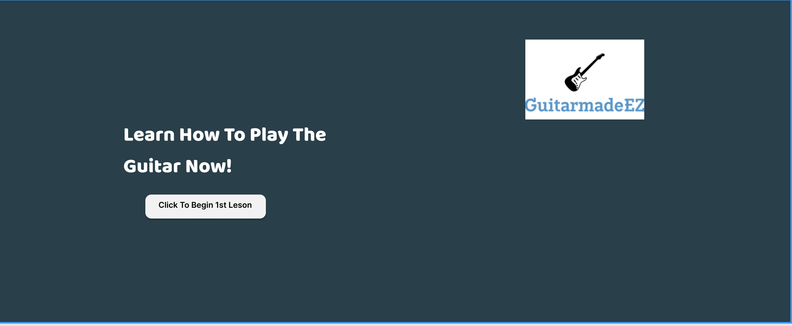
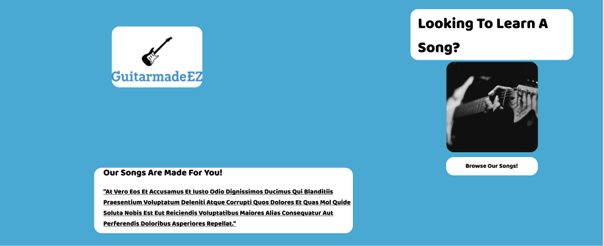
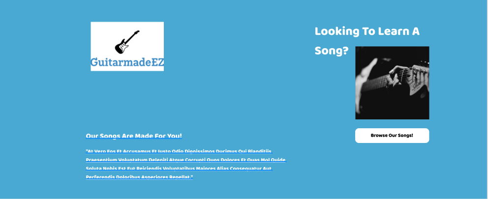
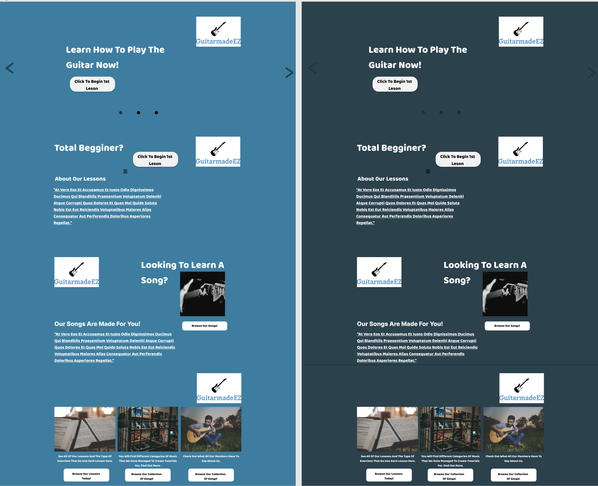
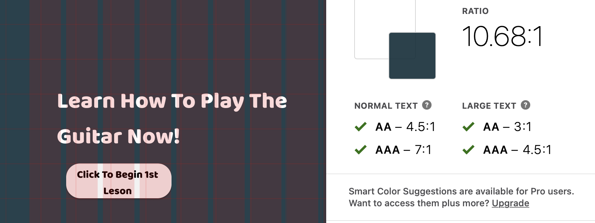
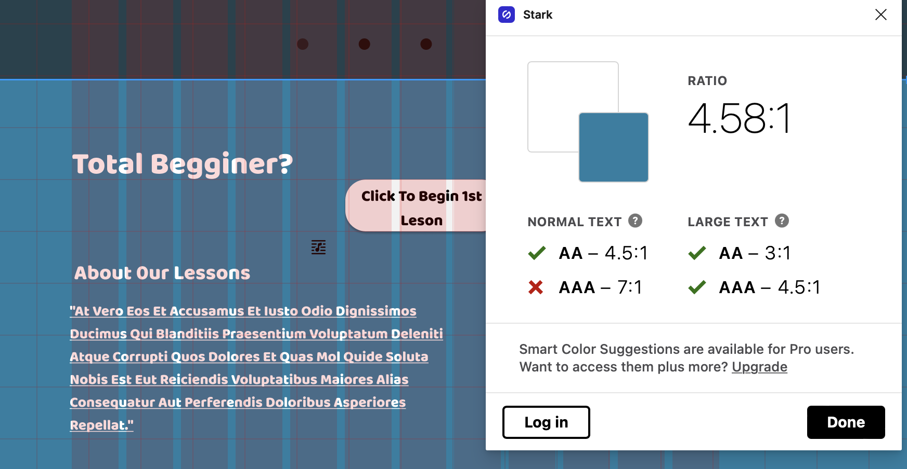

# Description

- The purpose of this assignment was to go from a low fidelity prototype to a working design within a single screen. I decided to focus on the landing page of my guitar learning website. For my guitar learning website, I want it to be a place where users can navigate the site either through their desktop/laptop, i will be working on the mobile device version as well. For this assignment I wanted to focus on the desktop version of the site. I began by creating a grid so that I can measure things proportionally. I spent a good amount of time working with the tools in order to understand how to properly manipulate the elements to produce the vision I have. I kept trying different elements, and variations to see what was most appealing to my eye. I created a wire frame and then I used it as my foundation for the website design. Please refer to the link below to see my entire design.

Link to prototype with work: 
https://www.figma.com/file/nylEGBoo9U3ylxfuDpFnWK/A6-interface-design-work-flow?node-id=31%3A6

 ## Screen design

## Typography varitation

  - I created 3 different version of my design using 3 different type of fonts. The first font is called ‘inter’ the second font is referred to as ‘kdam’, the third font is the font i went with for my final design which is ‘baloo’

## Shape variation 

  - For the shape variation of this assignment I created 3 different types of shapes variations. The first is circular, meaning I rounded the edges on buttons and images. The second is making the switch to a saure form rather than rounded. Lastly, for the last variation I combined the square and rounded elements in one variation.

## Color variation
 - For the color variations I created two types. I created a light mode and a dark mode. Below you will also see images of of the color contrast check.

  - color contrast verifaction 
 

## Design system 

  - Typeface
    - Font:Baloo
      - Color: Dark blue: 0D2D39 ,opacity :90%,
      - Light blue: 237EA2, White:FFFFFF, Black:000000 Header: Size 65
  - Sub header: Size 40
    - Main text: Size: 28
    - Small text: Size: 20
  - Headers
    - Color: White FFFFFF
  - Background Color: Dark blue: 0D2D39 ,opacity :90%, Light blue: 237EA2,
  - Layout Grid:
    - Size 100: 15% opacity
    - Columns: Count:12, opacity 15%
    - Type: center, 90
    - Gutter 15

## Impression Testing:

Link to doc with participant commentshttps://docs.google.com/document/d/1ih8RFpDUgj0Y1fFxqXILgVJy19ldft48sO5remPU-VQ/edit?usp=sharing

