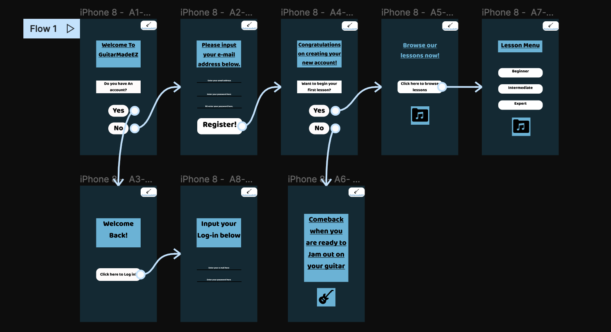
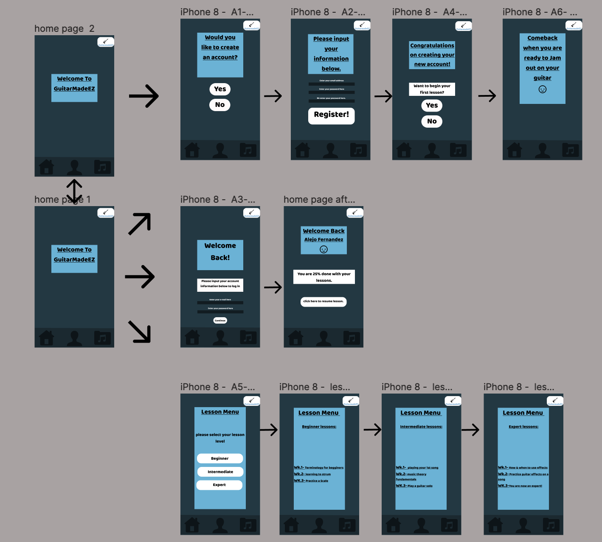

# Introduction

The goal of my project is to create a guitar learning website and application that is easy for use specifically targeted toward amateur/beginner guitar players. The purpose of the interactive prototypeis to layout the process of how the website/app will work. The process initially started with a low fidelity prototype as the general baseline for the layout. I then had to improve upon the low fidelity prototype by creating a screen using design principles such as: gridding, contrast color, font size, buttons, and more. After all of the screens were created i had to add interaction and test the interactions to see if they are user friendly.

## Task supported
  - Account creation
  - Log in with account
  - Browse lessons

## Interactive prototype link:
https://www.figma.com/file/sVdwsFhryjAheKoL7d6pWk/DH150-A8?node-id=0%3A1

## Wireflow with interface design.

First Version, before peer review.
 

Second Version, updates based on peer review 

## Cognitive walkthrough:

The cognitive walkthrough was conducted virtually. I had classmates visit my figma file and from there they left comments. I also had another classmate perform a cognitive walk through in person which allowed me to understand what the user wanted more of.

Below are the comments are were made during the cognitive walkthrough 

  - "On the app interphase/On landing page: The logo make it the home/return button.
    - The prompt “do you have an account” switch color from white to another blue 
  - On page 4 of the prototype
    - Delete the underline of the “Browse our lessons since it looks like a link.
    - Music icon looks clickable 
  - On page 5 “lesson menu
    - Music icon at the bottom give the impression that it is clickable 
  - On page 6 “ input your log in below”
    - Make the black line thicker and a different color for better contrast 
  - On page 8” come back when you are “Add an emoji or make it more friendly so that the user can feel encouraged to comeback 

Summary:

I think that the feedback my classmates relayed to me was very helpful. It made me create a uniform look and interactive design as well. I had to create more actions for each button that I had to incorporate in my design interface based on my peers' comments. I changed the color of some buttons, I also added more icons to make it seem friendlier and added a menu with a Home, account, and lesson button to quickly navigate users to those features of the app.

The process of the cognitive walkthrough was bumpy because i was only able to attain one interview in person and the rest of the improvements were made as comments on the first version of this prototype. The cognitive walkthrough taught me how easy it is to overlook the simple thing, which is why it is valuable to get a fresh perspective from someone other than yourself.

