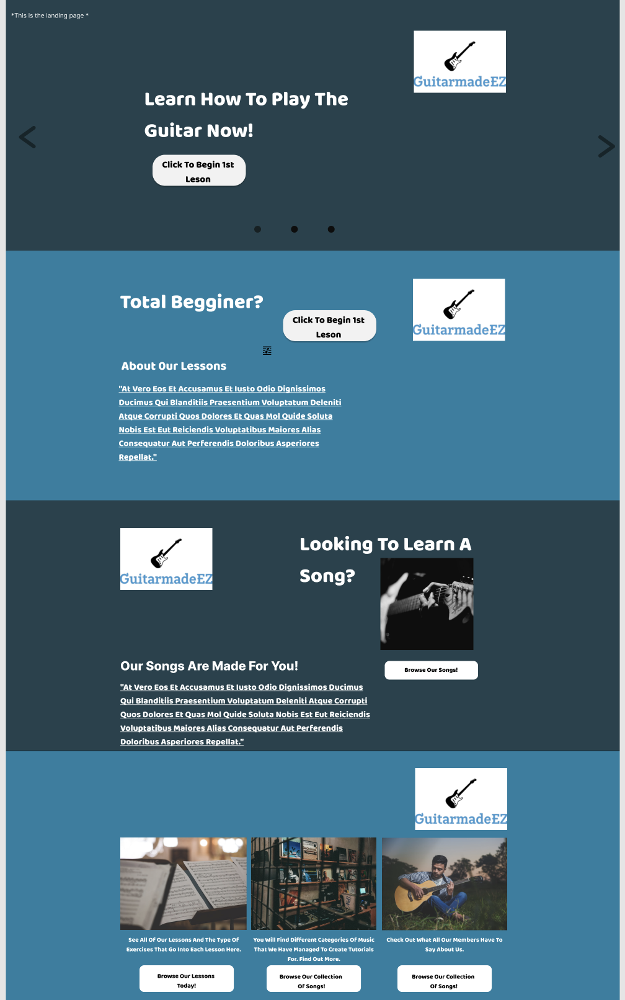
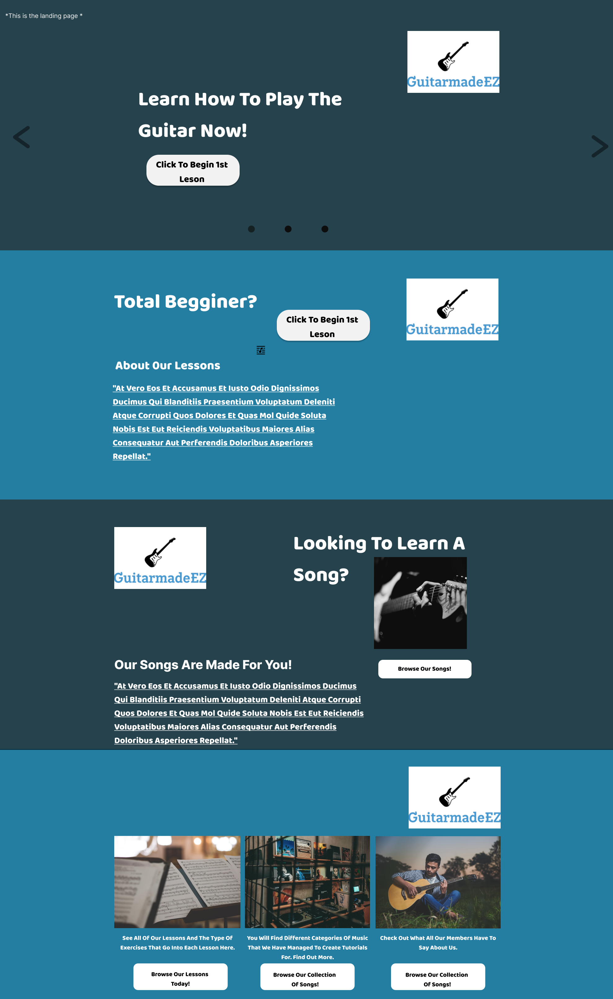
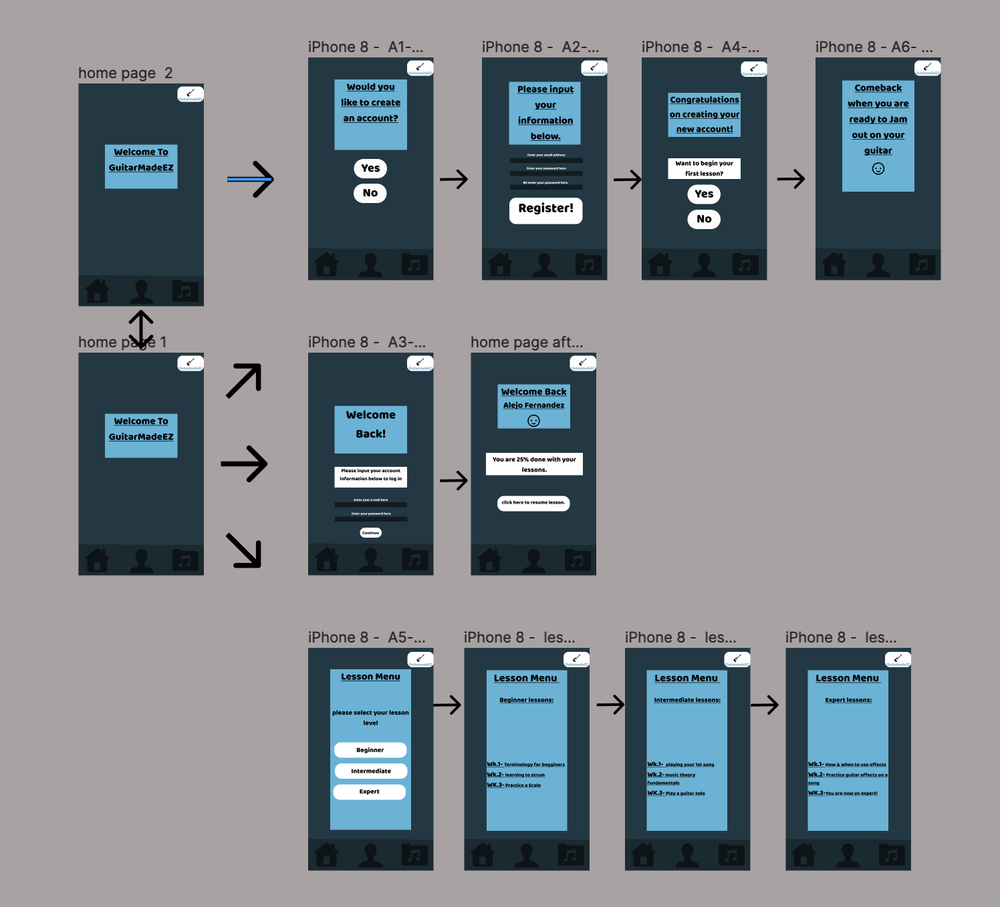

# GuiatarMadeEZ

Alejo Fernandez, Digital Humanities 150: UX/UI design Spring 2022 UCLA

Insert image here to support what guitarmadeez is 

## About this project

  - The goal of this project is to create an online guitar learning service that will make learning by yourself an easy and intuitive task.I want this project to consider middle-aged men as its target market. I want the users of GuitarmadeEZ to feel like they are navigating the website as easily as one navigates the google search bar. I also want to provide users with enough information to not overwhelm them, like a wikipedia abstract, so-to-speak. I think having a guitar learning website that is: easy to navigate,  provides a brief description of what you are learning, coupled with interactive learning seems like a recipe for success to me.

## Design statement

  - Most guitar learning websites either have too much information or lack information. This creates a barrier for people that want to learn how to play the guitar by themselves. Additional issues that users encounter is that if they find an intuitive website to learn to play the guitar it often comes with monthly fees or a music library with limited songs. My product allows users to learn how to play the guitar in 15 weeks. It has a structured plan and interactive lesson that allows first-time players to digest information properly. 

## Competitor Analysis 

  - Before embarking on this project I had to do some research on the type of services that already exist. I performed a Heuristic Evaluation and Usability test on a guitar learning website known as: https://www.andyguitar.co.uk
A summary on my Heaurictisc valuation. Overall this website is easy to navigate and gets you straight to the point when wanting to learn to play the guitar. The majority of users will find what they want and will be able to follow along to instructional videos for their guitar lesson needs. There are minor tweaks that can be made such as incorporating different colors so that tool icons can be visible, synchronization of guitar strumming and chords while the lesson is played on the video, and lastly a forum would increase the brands customer retention since it will allow users to engage with other like minded individuals.

  - Next I conducted a user testing to see if other people had the same thoughts about the competitor website I selected. The purpose of this test was to gather a baseline for how good or bad the website andyguitar.co.uk is for a middle aged man wanting to learn to play the guitar.The task I created for this usability test takes into consideration the type of task a new guitar player will encounter like navigating to the first lesson of the beginners course, searching for a song tutorial, or learning how to play the guitar without a pick.

  -   Heuristic Evaluation:

  - https://github.com/AlejoFernandez126/DH110-Ux-Ui/blob/main/A1/Heuristic%20Evaluation-README.md
  
  - Usability testing:
  
  - https://github.com/AlejoFernandez126/DH110-Ux-Ui/tree/main/A2-UT-Andyguitar.co.uk

## User Research

  - I wanted to create a guitar learning website that was intuitive for beginners or people that had never touched a guitar in their lives. I conducted user research with a participant that gave me insight on the type of activities needed to learn to play the guitar. What are some current options to learn to play the guitar as well. I spent a lot of time curating specific questions so that I can understand the target user as much as possible. Additional questions that I asked were: often do they play the guitar, what inspires them to play the guitar, and what are some ways that they practice playing the guitar. This part of the design process was crucial as it allowed me to understand what a user wanted from a guitar learning experience other than my own opinion on the matter. Essentially this allows me to back up my findings since I have field research.

  - User research link:
https://github.com/AlejoFernandez126/DH110-Ux-Ui/tree/main/A3-%20Contextual%20inquiry

## UX Storytelling

  - For the story telling aspect of this assignment I also had to perform some research. I had to understand the type of target user I am aiming for so that I can provide the best experience for them. One of the ways that I was able to do this was by creating “personas”. Essentially creating personas is the process of creating the target user. The process involved demographic data, motivations and needs for the product, goals, challenges and their story. I created 2 different buyer personas. One of the buyer personas is of american descent and the other is of latin american decent. I wanted to focus on these two types of ethnicities, and I selected these two ethnicities based on the popularity of guitar in their traditional media/music source.

  - UX storytelling: https://github.com/AlejoFernandez126/DH110-Ux-Ui/tree/main/A4-%20Persona%20%26%20usage%20scenerio

## Wireframe and graphic design element variation

  - After I conducted research on my target audience and interviewed people to understand the audience, the next task was to create a simple wireframe of how the application would look. The wireframes and flow will be based off of the task that our previous personas have executed.The type of task involved are creating an account, searching for a song tutorial, and selecting a specific lesson plan. The purpose of a low fidelity prototype is that it allows one to have a rough visualization of what the design is going to look like at the end of the process. Additionally, from this we can improve and make make changes to the design by showing this to other participants that would give me feedback. 

  - Wireframe: 
https://github.com/AlejoFernandez126/DH110-Ux-Ui/tree/main/A5-%20Low%20Fidelity%20Prototype

## Low fidelity Prototype 

  - After receiving feedback on my first version of the wireframe I decided to get more in depth with my design process. I used figma to create the prototypes. The goal was to go from a low fidelity prototype to a working design. It would demonstrate the process from the usersperstive from the landing page and into the three different tasks mentioned above. I made a desktop version and I also made a mobile version. I figured users would be inclined to both versions of the product and I thought it would help me understand the differences between a desktop and mobile UX/UI product. I spent  a lot of time developing both of these versions. I made sure to us specific colors and that the buttons/layout I implemented were there with a purpose.

  - Low fidelity prototype:
 
 

https://github.com/AlejoFernandez126/DH110-Ux-Ui/tree/main/A6-%20Interface%20Design%20Syste

Different design options: 

https://www.figma.com/file/nylEGBoo9U3ylxfuDpFnWK/A6-interface-design-work-flow?node-id=0%3A1

## High Fidelity Prototype 

  - For this assignment, we moved from the low fidelity to a high fidelity prototype. This part of the project required paying attention to detail and really focusing on how the sre would interact with the product. The purpose of the interactive prototype is to layout the process of how the website/app will work. The process initially started with a low fidelity prototype as the general baseline for the layout. I then had to improve upon the low fidelity prototype by creating a screen using design principles such as: gridding, contrast color, font size, buttons, and more. After all of the screens were created I had to add interaction and test the interactions to see if they are user friendly.

  - High fidelity prototype process:

  - https://github.com/AlejoFernandez126/DH110-Ux-Ui/tree/main/A7-High%20Fidelity%20Prototype

  - High fidelity prototype Mobile Version:

  - https://www.figma.com/file/sVdwsFhryjAheKoL7d6pWk/Dh110-A7?node-id=0%3A1

## Pitch Video

Embeded code here

## Conclusion

  - This was my first UX/UI class, before we began our project I had a different understanding of how to properly go about creating a successful website/ application design and interface. I thought it was a valuable and rewarding experience. I didn't realize the type or depth of research that goes into the development of a website or app. I also had no previous experience using figma nor any other type of design software. At first this was overwhelming as it was a lot to take in but towards the end of the project it felt intuitive and I actually began to work on figma in my free time. I think this course has allowed me to understand the backend of websites as well. I think it is extremely valuable to be able to communicate with web developers in an effective manner and vice versa, I truly think this class has enabled me to communicate with web developers effectively. Another lesson that I took away from this experience is that the design process is fluid and this can feel daunting at first but liberating once you get a rhythm going. 

